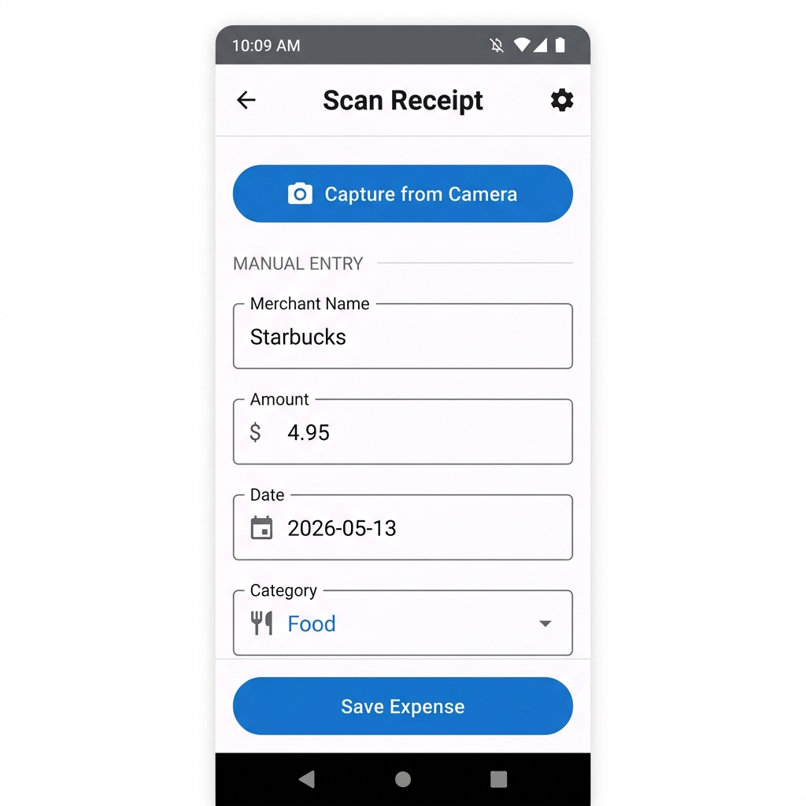
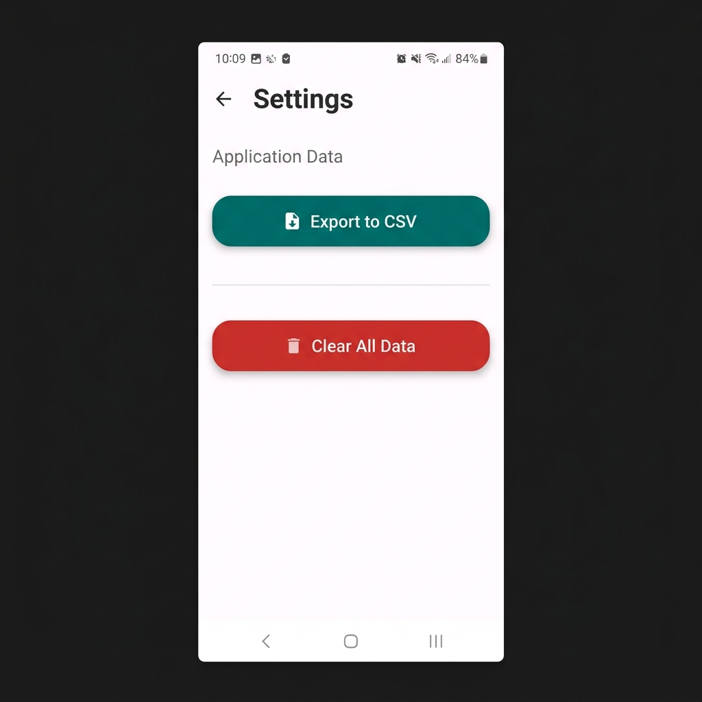

<p align="center">
  
  
  
  
  
</p>

# 📸 Snap2Sheet — AI-Powered Expense Tracker

> An Android application that uses **on-device OCR** (Google ML Kit) to scan paper receipts, automatically extract expense data, persist it in a local **Room** database, and present spending analytics through interactive charts — all built on the **MVVM** architecture with **Kotlin Coroutines** and **Jetpack Navigation**.

---

## Table of Contents

1. [Screenshots](#screenshots)
2. [Feature Overview](#feature-overview)
3. [Architecture](#architecture)
4. [Project Structure](#project-structure)
5. [Module & File Walkthrough](#module--file-walkthrough)
6. [Data Flow](#data-flow)
7. [Tech Stack & Dependencies](#tech-stack--dependencies)
8. [Design Patterns Used](#design-patterns-used)
9. [Setup & Build Instructions](#setup--build-instructions)
10. [How the App Works (User Flow)](#how-the-app-works-user-flow)
11. [Key Implementation Details](#key-implementation-details)
12. [Scope for Improvement](#scope-for-improvement)
13. [References & Learning Resources](#references--learning-resources)
14. [License](#license)

---

## Screenshots

<p align="center">
  
  &nbsp;&nbsp;
  
  &nbsp;&nbsp;
  
  &nbsp;&nbsp;
  
</p>

<p align="center">
  <sub>Scan Receipt &nbsp;|&nbsp; Expenses List &nbsp;|&nbsp; Analytics Dashboard &nbsp;|&nbsp; Settings</sub>
</p>

---

## Feature Overview

| # | Feature | Description |
|---|---------|-------------|
| 1 | **Receipt OCR Scanning** | Capture a photo of any receipt; Google ML Kit extracts merchant name, total amount, and date automatically. |
| 2 | **Expense CRUD** | Create, read, and delete expenses. Each expense stores merchant name, amount, category, date, notes, and an optional image path. |
| 3 | **Search & Filter** | Real-time search across expenses by merchant name using `Flow` + `flatMapLatest`. |
| 4 | **Swipe-to-Delete** | Swipe any expense card left or right to delete it (using `ItemTouchHelper`). |
| 5 | **Analytics Dashboard** | Interactive **Pie Chart** (spending by category) and **Bar Chart** (spending by month) powered by MPAndroidChart. |
| 6 | **CSV Export** | Export all expenses to a `.csv` file, then share via Android's Share Sheet. |
| 7 | **Offline-First** | All data is stored locally with Room. No internet connection required. |
| 8 | **Sample Data** | On first launch, the app seeds 5 sample expenses so charts and list aren't empty. |

---

## Architecture

This project follows the **MVVM (Model-View-ViewModel)** architectural pattern recommended by Google's Guide to App Architecture.

```
┌──────────────────────────────────────────────────────────────────┐
│                          VIEW LAYER                              │
│  Fragments (UI) ←→ ViewBinding ←→ XML Layouts                   │
│  • ScanFragment         • ExpensesFragment                       │
│  • AnalyticsFragment    • SettingsFragment                       │
├──────────────────────────────────────────────────────────────────┤
│                       VIEWMODEL LAYER                            │
│  ViewModels expose LiveData / StateFlow to the UI                │
│  • ScanViewModel        • ExpensesViewModel                      │
│  • AnalyticsViewModel   • SettingsViewModel                      │
├──────────────────────────────────────────────────────────────────┤
│                      REPOSITORY LAYER                            │
│  Single Source of Truth — abstracts DAO from ViewModels          │
│  • ExpenseRepository                                             │
├──────────────────────────────────────────────────────────────────┤
│                        DATA LAYER                                │
│  Room Database + DAO + Entity                                    │
│  • ExpenseDatabase  • ExpenseDao  • Expense (Entity)             │
│  • ML Kit OCR Engine (OCRHelper)                                 │
└──────────────────────────────────────────────────────────────────┘
```

### Why MVVM?

| Concern | Where it lives |
|---------|----------------|
| UI rendering, user interaction | **View** (Fragments + XML) |
| Business logic, state management | **ViewModel** |
| Data access, caching | **Repository** |
| Persistence, queries | **Room DAO + Database** |

> **Key principle:** The UI never accesses the database directly. Data always flows `DAO → Repository → ViewModel → Fragment`.

---

## Project Structure

```
Snap2Sheet/
├── app/
│   ├── build.gradle                            # App-level dependencies & plugins
│   └── src/main/
│       ├── AndroidManifest.xml                  # Permissions, Activity, FileProvider
│       ├── java/com/ayush/snap2sheet/
│       │   ├── MainActivity.kt                  # Host Activity + sample data seeding
│       │   ├── Snap2SheetApp.kt                 # Application class (initializes DB + Repo)
│       │   ├── data/
│       │   │   ├── Expense.kt                   # Room @Entity — expense table schema
│       │   │   ├── ExpenseDao.kt                # Room @Dao — SQL queries
│       │   │   ├── ExpenseDatabase.kt           # Room @Database — DB singleton
│       │   │   ├── ExpenseRepository.kt         # Repository pattern wrapper
│       │   │   └── ReportData.kt                # Data classes for aggregated reports
│       │   ├── ui/
│       │   │   ├── scan/
│       │   │   │   ├── ScanFragment.kt          # Camera capture + OCR result display
│       │   │   │   └── ScanViewModel.kt         # Coordinates OCR + save operations
│       │   │   ├── expenses/
│       │   │   │   ├── ExpensesFragment.kt      # RecyclerView list + search + swipe
│       │   │   │   ├── ExpenseAdapter.kt        # ListAdapter with DiffUtil
│       │   │   │   └── ExpensesViewModel.kt     # Reactive search with flatMapLatest
│       │   │   ├── analytics/
│       │   │   │   ├── AnalyticsFragment.kt     # Pie & Bar charts rendering
│       │   │   │   └── AnalyticsViewModel.kt    # Exposes aggregated StateFlows
│       │   │   └── settings/
│       │   │       ├── SettingsFragment.kt      # CSV export + clear data
│       │   │       └── SettingsViewModel.kt     # Export + delete operations
│       │   ├── utils/
│       │   │   ├── OCRHelper.kt                 # ML Kit text recognition + parsing
│       │   │   ├── CsvExporter.kt               # Writes expense list to CSV file
│       │   │   ├── DateUtils.kt                 # Date formatting helpers
│       │   │   └── ViewModelFactory.kt          # Custom ViewModelProvider.Factory
│       │   └── di/                              # (Reserved for DI modules)
│       └── res/
│           ├── layout/                          # XML layouts for Activity + Fragments
│           ├── navigation/nav_graph.xml         # Jetpack Navigation graph
│           ├── menu/bottom_nav_menu.xml         # Bottom navigation items
│           ├── values/                          # Strings, colors, themes, arrays
│           └── xml/file_paths.xml               # FileProvider path config
├── build.gradle                                 # Root-level plugin versions
├── settings.gradle                              # Project name + repositories
├── gradle.properties                            # Kotlin/AndroidX flags
└── screenshots/                                 # App screenshots for README
```

---

## Module & File Walkthrough

### 1. Application Bootstrap

#### `Snap2SheetApp.kt` — Application Class

```kotlin
class Snap2SheetApp : Application() {
    lateinit var database: ExpenseDatabase
    lateinit var repository: ExpenseRepository

    override fun onCreate() {
        super.onCreate()
        database = Room.databaseBuilder(this, ExpenseDatabase::class.java, "expense_db").build()
        repository = ExpenseRepository(database.expenseDao())
    }
}
```

- Initializes the **Room database** and creates a single **Repository** instance when the app starts.
- All Fragments access the repository via `(requireActivity().application as Snap2SheetApp).repository`.
- This acts as a **manual dependency injection** — the Application class is the composition root.

#### `MainActivity.kt` — Single Activity Host

- Uses `FragmentContainerView` + `NavHostFragment` to host all four Fragment destinations.
- `BottomNavigationView.setupWithNavController(navController)` wires bottom nav tabs to the navigation graph.
- `checkAndAddSampleData()` seeds 5 sample expenses on first launch when the database is empty.

---

### 2. Data Layer

#### `Expense.kt` — Room Entity

```kotlin
@Entity(tableName = "expenses")
data class Expense(
    @PrimaryKey(autoGenerate = true) val id: Int = 0,
    val merchantName: String,
    val amount: Double,
    val category: String,
    val date: String,         // Format: "YYYY-MM-DD"
    val notes: String = "",
    val imagePath: String = ""
)
```

Each field becomes a column in the SQLite `expenses` table. `@PrimaryKey(autoGenerate = true)` creates an auto-incrementing integer ID.

#### `ExpenseDao.kt` — Data Access Object

| Method | SQL Operation | Return Type |
|--------|--------------|-------------|
| `insertExpense()` | `INSERT OR REPLACE` | `suspend` (one-shot) |
| `updateExpense()` | `UPDATE` | `suspend` (one-shot) |
| `deleteExpense()` | `DELETE` | `suspend` (one-shot) |
| `clearAll()` | `DELETE FROM expenses` | `suspend` (one-shot) |
| `getAllExpenses()` | `SELECT * ORDER BY date DESC` | `Flow<List<Expense>>` (reactive) |
| `searchExpenses(query)` | `WHERE merchantName LIKE '%query%'` | `Flow<List<Expense>>` (reactive) |
| `getCategoryTotals()` | `SELECT category, SUM(amount) GROUP BY category` | `Flow<List<CategoryTotal>>` |
| `getMonthlyTotals()` | `SELECT substr(date,1,7), SUM(amount) GROUP BY month` | `Flow<List<MonthlyTotal>>` |
| `getTotalExpense()` | `SELECT SUM(amount)` | `Flow<Double?>` |

> **Key concept:** Write operations are `suspend` functions (one-shot coroutines). Read operations return `Flow` for **reactive, real-time** updates — any database change automatically pushes new data to the UI.

#### `ReportData.kt` — Aggregation DTOs

```kotlin
data class CategoryTotal(val category: String, val total: Double)
data class MonthlyTotal(val month: String, val total: Double)
```

These are POJOs that Room maps the `GROUP BY` query results into. They are used by the Analytics charts.

#### `ExpenseRepository.kt` — Repository Pattern

Thin wrapper around `ExpenseDao`. In a production app this is where you'd merge local + remote data sources, but here it serves as the **single source of truth** abstraction, decoupling ViewModels from Room internals.

---

### 3. UI Layer — Scan Module

#### `ScanFragment.kt`

1. **Camera Capture:** Uses `ActivityResultContracts.TakePicture()` — the modern replacement for `startActivityForResult()`. Creates a temp file via `FileProvider`, launches the system camera, and receives the result.
2. **OCR Processing:** On successful capture, passes the image URI to `ScanViewModel.processImage()`.
3. **Auto-fill:** Observes `viewModel.receiptData` LiveData. When OCR completes, the extracted merchant, amount, and date auto-fill the form fields.
4. **Save:** Validates inputs, builds an `Expense` object, and calls `viewModel.saveExpense()`.

#### `ScanViewModel.kt`

Exposes three `LiveData` streams:

| LiveData | Purpose |
|----------|---------|
| `receiptData` | OCR-extracted `ReceiptData` (merchant, amount, date) |
| `isLoading` | Controls progress bar & button enabled state |
| `saveStatus` | Triggers success toast + form reset |

---

### 4. UI Layer — Expenses Module

#### `ExpensesFragment.kt`

- **RecyclerView** with `LinearLayoutManager` displays the expense list.
- **Search:** `TextWatcher` on the search `EditText` pushes every keystroke to `viewModel.setSearchQuery()`.
- **Swipe-to-Delete:** `ItemTouchHelper.SimpleCallback` handles left/right swipe gestures.
- **Empty State:** Shows "No expenses found." when the list is empty.

#### `ExpenseAdapter.kt`

Extends `ListAdapter<Expense, ViewHolder>` with `DiffUtil.ItemCallback` for efficient list updates:

```kotlin
class ExpenseDiffCallback : DiffUtil.ItemCallback<Expense>() {
    override fun areItemsTheSame(old: Expense, new: Expense) = old.id == new.id
    override fun areContentsTheSame(old: Expense, new: Expense) = old == new
}
```

> **Why `ListAdapter` over `RecyclerView.Adapter`?** `ListAdapter` uses `AsyncListDiffer` internally to compute list diffs on a background thread, so only changed items are re-rendered. This gives smooth 60fps scrolling.

#### `ExpensesViewModel.kt` — Reactive Search

```kotlin
private val searchQuery = MutableStateFlow("")

val expenses: StateFlow<List<Expense>> = searchQuery
    .flatMapLatest { query ->
        if (query.isBlank()) repository.getAllExpenses()
        else repository.searchExpenses(query)
    }
    .stateIn(viewModelScope, SharingStarted.Lazily, emptyList())
```

> **How `flatMapLatest` works:** Every time the user types a character, `searchQuery` emits a new value. `flatMapLatest` cancels the previous database query and starts a new one with the updated query. This prevents stale results from overwriting fresh ones.

---

### 5. UI Layer — Analytics Module

#### `AnalyticsFragment.kt`

Sets up two MPAndroidChart instances:

| Chart | Type | Data Source |
|-------|------|-------------|
| **Pie Chart** | Category breakdown | `viewModel.categoryTotals` |
| **Bar Chart** | Monthly totals | `viewModel.monthlyTotals` |

Uses `repeatOnLifecycle(STARTED)` to collect `StateFlow` values safely — collection automatically pauses when the Fragment goes to the background, preventing memory leaks.

#### `AnalyticsViewModel.kt`

All three properties are `StateFlow`s created with `.stateIn()`:

```kotlin
val totalExpense: StateFlow<Double?> = repository.getTotalExpense()
    .stateIn(viewModelScope, SharingStarted.Lazily, 0.0)
```

> **`SharingStarted.Lazily`** means the upstream `Flow` only starts collecting when the first subscriber appears. This avoids unnecessary database queries when the Analytics tab hasn't been opened yet.

---

### 6. UI Layer — Settings Module

#### `SettingsFragment.kt`

Two actions:

1. **Export to CSV** → Calls `CsvExporter.exportToCsv()`, then opens Android Share Sheet via `Intent.ACTION_SEND` with MIME type `text/csv`.
2. **Clear All Data** → Shows a confirmation `AlertDialog`, then calls `repository.clearAll()`.

---

### 7. Utilities

#### `OCRHelper.kt` — ML Kit Text Recognition

```
Receipt Image → InputImage.fromFilePath() → TextRecognizer.process() → Raw Text → extractData()
```

The `extractData()` method uses regex-based heuristics:

| Data Point | Extraction Strategy |
|------------|-------------------|
| **Merchant** | First line of recognized text |
| **Amount** | Regex for `total/amount/sum` keyword followed by a number; fallback: largest decimal number in text |
| **Date** | Regex for `DD/MM/YYYY` or `DD-MM-YYYY` patterns; fallback: current date |

#### `CsvExporter.kt`

Writes expenses to `getExternalFilesDir(DIRECTORY_DOCUMENTS)/ExpensesExport_{timestamp}.csv` with proper CSV quoting for fields that might contain commas.

#### `ViewModelFactory.kt`

Custom `ViewModelProvider.Factory` that injects `ExpenseRepository` into each ViewModel. This is necessary because ViewModels with constructor parameters can't be created by the default factory.

#### `DateUtils.kt`

Two utility functions:
- `getCurrentDate()` → `"yyyy-MM-dd"` format
- `formatForDisplay()` → `"MMM dd, yyyy"` format (e.g., "Oct 05, 2023")

---

## Data Flow

### Receipt Scan → Save Flow

```
User taps "Capture from Camera"
    │
    ▼
FileProvider creates temp URI  →  System Camera (TakePicture contract)
    │
    ▼
ScanViewModel.processImage(uri)
    │
    ▼
OCRHelper.processImage()
    ├── InputImage.fromFilePath(context, uri)
    ├── TextRecognizer.process(image).await()    ← Coroutine suspension
    └── extractData(rawText)                     ← Regex parsing
    │
    ▼
LiveData<ReceiptData> emitted  →  Fragment auto-fills EditTexts
    │
    ▼
User reviews & taps "Save Expense"
    │
    ▼
ScanViewModel.saveExpense(expense)
    │
    ▼
Repository.insertExpense()  →  DAO.insertExpense()  →  Room  →  SQLite
```

### Reactive List Update Flow

```
Database change (insert/delete)
    │
    ▼
Room DAO emits new Flow<List<Expense>>
    │
    ▼
Repository passes Flow through
    │
    ▼
ViewModel.expenses (StateFlow via flatMapLatest)
    │
    ▼
Fragment collects in repeatOnLifecycle(STARTED)
    │
    ▼
ListAdapter.submitList()  →  DiffUtil computes diff  →  RecyclerView updates
```

---

## Tech Stack & Dependencies

| Category | Library | Version | Purpose |
|----------|---------|---------|---------|
| **Language** | Kotlin | 1.6.10 | Primary language |
| **Build** | Android Gradle Plugin | 7.1.3 | Build system |
| **UI** | Material Components | 1.7.0 | Material Design 3 widgets |
| **UI** | ConstraintLayout | 2.1.4 | Flexible layouts |
| **UI** | CardView | (bundled) | Expense list cards |
| **Navigation** | Jetpack Navigation | 2.5.3 | Fragment navigation + SafeArgs |
| **Lifecycle** | ViewModel + LiveData | 2.5.1 | Lifecycle-aware state management |
| **Database** | Room | 2.4.3 | SQLite abstraction with compile-time query verification |
| **Async** | Kotlin Coroutines | 1.6.4 | Structured concurrency |
| **Camera** | CameraX | 1.2.0-rc01 | Camera API (used for FileProvider URI generation) |
| **ML/AI** | Google ML Kit OCR | 16.0.0 | On-device text recognition |
| **Charts** | MPAndroidChart | 3.1.0 | Pie and Bar chart rendering |

---

## Design Patterns Used

| Pattern | Where | Why |
|---------|-------|-----|
| **MVVM** | Entire app | Separates UI from business logic; survives configuration changes |
| **Repository** | `ExpenseRepository` | Abstracts data source; single source of truth |
| **Observer** | `LiveData`, `StateFlow`, `Flow` | Reactive UI updates without manual refresh |
| **Factory** | `ViewModelFactory` | Allows constructor injection into ViewModels |
| **Singleton** | `Snap2SheetApp` holds DB + Repo | Single database instance across the app |
| **Adapter** | `ExpenseAdapter` | Binds data to RecyclerView with `DiffUtil` efficiency |
| **Strategy** | `OCRHelper.extractData()` | Swappable parsing strategies (regex-based) |

---

## Setup & Build Instructions

### Prerequisites

| Requirement | Version |
|-------------|---------|
| Android Studio | Dolphin (2021.3.1) or newer |
| JDK | 11 |
| Gradle | 7.2 (bundled wrapper) |
| Target Device/Emulator | API 24+ (Android 7.0 Nougat) |

### Steps

```bash
# 1. Clone the repository
git clone https://github.com/ayush-godara/Snap2Sheet.git
cd Snap2Sheet

# 2. Open in Android Studio
#    File → Open → Select the cloned directory
#    Wait for Gradle sync to complete

# 3. Build & Run
#    Select a target device/emulator (API 24+)
#    Click ▶ Run or press Shift+F10
```

### Required Permissions

| Permission | Purpose | When Requested |
|------------|---------|----------------|
| `CAMERA` | Capture receipt photos | First scan attempt |
| `READ_EXTERNAL_STORAGE` (≤ API 32) | Access gallery images | If using gallery picker |
| `READ_MEDIA_IMAGES` (API 33+) | Scoped storage access | If using gallery picker |

---

## How the App Works (User Flow)

```
┌──────────┐    ┌──────────┐    ┌───────────┐    ┌──────────┐
│   Scan   │    │ Expenses │    │ Analytics │    │ Settings │
│   Tab    │    │   Tab    │    │    Tab    │    │   Tab    │
└────┬─────┘    └────┬─────┘    └─────┬─────┘    └────┬─────┘
     │               │               │               │
     ▼               ▼               ▼               ▼
 Capture         View all        Pie chart        Export CSV
 receipt         expenses        by category      to file
     │               │               │               │
     ▼               │               ▼               ▼
 OCR extracts    Search by       Bar chart        Share via
 merchant,       merchant        by month         Share Sheet
 amount, date    name                                 │
     │               │               │               ▼
     ▼               ▼               │           Clear all
 Review &        Swipe to           │           data
 save expense    delete             │
     │               │               │
     └───────────────┴───────────────┘
              All data stored locally
              in Room SQLite database
```

---

## Key Implementation Details

### 1. Reactive Search with StateFlow

The search feature in `ExpensesViewModel` uses `flatMapLatest` — one of the most powerful Kotlin Flow operators:

```kotlin
searchQuery.flatMapLatest { query ->
    if (query.isBlank()) repository.getAllExpenses()
    else repository.searchExpenses(query)
}
```

When the user types "Star", then "Starb", the flow for "Star" is **automatically cancelled** before the flow for "Starb" starts. This prevents race conditions and stale data.

### 2. Lifecycle-Safe Collection

All Fragment-to-ViewModel communication uses `repeatOnLifecycle`:

```kotlin
viewLifecycleOwner.lifecycleScope.launch {
    viewLifecycleOwner.repeatOnLifecycle(Lifecycle.State.STARTED) {
        viewModel.expenses.collect { /* update UI */ }
    }
}
```

This ensures collection **stops** when the Fragment is in the background and **restarts** when it comes back — preventing crashes from updating views after `onDestroyView()`.

### 3. ViewModelFactory for Constructor Injection

Since all ViewModels need `ExpenseRepository`, the custom `ViewModelFactory` maps each ViewModel class to its constructor call. Each Fragment creates its ViewModel like this:

```kotlin
private val viewModel: ScanViewModel by viewModels {
    ViewModelFactory((requireActivity().application as Snap2SheetApp).repository)
}
```

### 4. FileProvider for Camera

The app uses `FileProvider` to generate content URIs for captured photos, which is required for API 24+ (strict mode `file://` URI restrictions). The provider path is declared in `res/xml/file_paths.xml` and registered in `AndroidManifest.xml`.

### 5. Room Flow Integration

Room generates `Flow` implementations that emit a new `List<Expense>` whenever any row in the `expenses` table is modified. This is what makes the app **reactive** — no manual "refresh" needed.

---

## Scope for Improvement

These are areas where the project can be extended for further learning or feature development:

| Area | Improvement |
|------|-------------|
| **DI** | Replace manual DI with Hilt/Dagger for scalable dependency injection |
| **OCR Accuracy** | Improve `extractData()` regex patterns or integrate an LLM-based parser |
| **Image Storage** | Store receipt images in app-specific storage with proper lifecycle management |
| **Date Picker** | Use `MaterialDatePicker` instead of manual text input for dates |
| **Multi-Currency** | Add currency selection and conversion support |
| **Budgets** | Add budget limits per category with alerts |
| **Dark Theme** | Add a dark mode toggle with Material You dynamic theming |
| **Testing** | Add unit tests for ViewModel + Repository, and UI tests with Espresso |
| **Migration** | Add Room database migrations for schema version upgrades |
| **Cloud Sync** | Add Firebase/backend sync for cross-device access |

---

## References & Learning Resources

| Topic | Resource |
|-------|----------|
| MVVM Architecture | [Guide to App Architecture — Android Developers](https://developer.android.com/topic/architecture) |
| Room Database | [Save data in a local database — Android Developers](https://developer.android.com/training/data-storage/room) |
| Kotlin Coroutines | [Coroutines on Android — Android Developers](https://developer.android.com/kotlin/coroutines) |
| StateFlow & SharedFlow | [StateFlow and SharedFlow — Kotlin Docs](https://kotlinlang.org/docs/flow.html#stateflow-and-sharedflow) |
| Jetpack Navigation | [Navigation Component — Android Developers](https://developer.android.com/guide/navigation) |
| ML Kit Text Recognition | [Recognize text in images — Google ML Kit](https://developers.google.com/ml-kit/vision/text-recognition/v2/android) |
| ViewBinding | [View Binding — Android Developers](https://developer.android.com/topic/libraries/view-binding) |
| CameraX | [CameraX Overview — Android Developers](https://developer.android.com/training/camerax) |
| MPAndroidChart | [MPAndroidChart Wiki — GitHub](https://github.com/PhilJay/MPAndroidChart/wiki) |
| ListAdapter & DiffUtil | [Create dynamic lists — Android Developers](https://developer.android.com/develop/ui/views/layout/recyclerview) |

---

## License

This project is open source and available under the [MIT License](LICENSE).

---

<p align="center">
  Built by <a href="https://github.com/ayush-godara">Ayush Godara</a>
</p>
